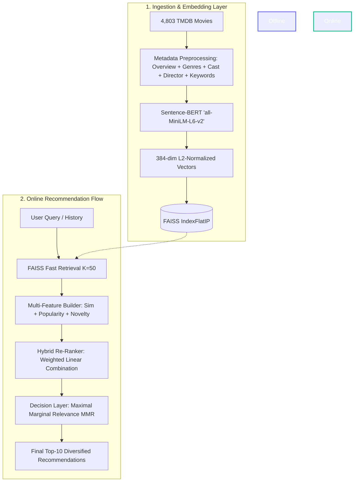

# 🎬 CineCrave — Production-Grade Movie Recommender System

<p align="center">
  
  
  
  
  
</p>

---

## 🌟 Overview

**CineCrave** is a high-performance, content-based movie recommendation system designed with an industry-standard **Retrieve $\to$ Rank $\to$ Decide** two-stage architecture.

Unlike toy recommender notebooks that simply compute cosine similarity across an entire catalog, CineCrave decouples **fast vector candidate generation ($O(\log N)$ via FAISS)** from **multi-objective hybrid ranking** (semantic relevance, log-popularity, and novelty) and a **decision layer** utilizing **Maximal Marginal Relevance (MMR)** to prevent filter bubbles and franchise clustering.

> 💡 **Visual Interactive Docs:** Open [`docs.html`](file:///Users/kavydave/Desktop/CineCrave-main/docs.html) in any browser to see the colorful animated system pipeline and live simulator!

---

## 🏗️ System Architecture



---

## 🔬 Core Algorithms & Mathematical Foundations

### 1. Fast Candidate Retrieval (FAISS)
* **Embedding Model:** `all-MiniLM-L6-v2` (384-dimensional dense semantic vectors).
* **Index Type:** `faiss.IndexFlatIP` (Exact Inner Product with $L_2$-normalized vectors, computing cosine similarity in sub-millisecond latency):
$$\text{Cosine Similarity}(u, v) = \frac{u \cdot v}{\|u\|_2 \|v\|_2} = u_{\text{norm}} \cdot v_{\text{norm}}$$

### 2. Multi-Objective Hybrid Ranking
Instead of relying solely on similarity (which causes unpopular movies to be ignored and popular movies to dominate), CineCrave applies weighted multi-feature scoring:

$$\text{Score}(d) = w_{\text{sim}} \cdot \text{Sim}_{\text{norm}}(d) + w_{\text{pop}} \cdot \text{Pop}_{\text{norm}}(d) + w_{\text{nov}} \cdot \text{Nov}_{\text{norm}}(d)$$

* **Popularity:** TMDB continuous popularity scores.
* **Novelty:** Inversely proportional to logarithmic popularity (rewards high-quality hidden gems):
$$\text{Novelty}(d) = \frac{1}{\log(1 + \text{Popularity}(d)) + 1.0}$$

### 3. Decision Layer: Maximal Marginal Relevance (MMR)
Prevents recommendation lists from returning 5 sequels of the same movie (e.g., 5 Batman movies for *"The Dark Knight"*):

$$\text{MMR}(d_i) = \operatorname{argmax}_{d_i \in C \setminus S} \left[ \lambda \cdot \text{Score}(d_i, Q) - (1 - \lambda) \max_{d_j \in S} \text{Sim}(d_i, d_j) \right]$$

* $\lambda = 0.7$: Balances high relevance ($70\%$) while actively penalizing pairwise similarity to already selected items ($30\%$).

---

## ⚡ Quickstart & CLI Usage

### 1. Item-Based Movie Recommendation
Recommend movies similar to a specific title:
```bash
python3 -m src.cli recommend --movie "The Dark Knight"
```
**Output:**
```
[REQUEST START] id=193294c6 movie= The Dark Knight
[CANDIDATES]  count = 50
[RANKED] top5=['The Dark Knight Rises', 'Batman Begins', 'Batman', 'Batman v Superman', 'Batman & Robin']
[REQUEST END] returned=10 (Diversified via MMR)
1. The Dark Knight Rises (Score: 0.923)
2. Batman 1989 (Score: 0.840)
3. Batman Begins (Score: 0.853)
4. Defendor (Score: 0.360)
5. Brick Mansions (Score: 0.310)
6. Megamind (Score: 0.298)
7. Pulp Fiction (Score: 0.266)
```

### 2. User History-Based Personalization
Recommend movies based on a user's multi-movie watch history:
```bash
python3 -m src.cli user --history "Interstellar,Inception"
```

---

## 📂 Repository Structure

```
CineCrave/
├── candidate_generation/
│   ├── embeddings.py         # Sentence-BERT embedding pipeline
│   └── faiss_index.py        # FAISS vector index build, save, and search
├── ranking/
│   ├── features.py           # Similarity, popularity, and novelty feature normalization
│   └── rank.py               # Multi-objective hybrid ranking engine
├── decision_layer/
│   ├── constraints.py        # Franchise and business constraints
│   └── post_process.py       # Maximal Marginal Relevance (MMR) diversity algorithm
├── src/
│   ├── cli.py                # Command-line interface entry point
│   ├── recommender.py        # Item-based pipeline coordinator with logging
│   └── personalization.py    # User-history embedding aggregator
├── data/
│   └── movies_cleaned.csv    # Processed metadata with TMDB popularity (4,803 titles)
├── config.yaml               # Centralized hyperparameters & weights
├── config_loader.py          # YAML config parser
├── evaluation_report.md      # Methodological evaluation document
├── docs.html                 # 🎨 Colorful Interactive Dashboard & Architecture visualizer
└── requirements.txt          # Project dependencies
```

---

## ⚙️ Configuration (`config.yaml`)

```yaml
paths:
  data_dir: data/
  movie_vectors: movies_embeddings.pkl
  faiss_index: movie_faiss.index

model:
  embedding_model: all-MiniLM-L6-v2

ranking:
  weights:
    similarity: 0.85     # Semantic text similarity weight
    popularity: 0.10     # Mainstream popularity bias
    novelty: 0.05        # Discovery / novelty reward

candidate_generation:
  faiss_k: 50            # Candidate retrieval pool size
  final_k: 10            # Top-K recommendations to display

decision_layer:
  use_mmr: true          # Enable Maximal Marginal Relevance
  diversity_lambda: 0.7  # 0.7 = 70% relevance, 30% diversity penalty
```

---

## 🎯 Key Design Decisions & System Tradeoffs

1. **Why Two-Stage Retrieve-and-Rank?**
   * *Trade-off:* Full catalog re-ranking is $O(N)$ and takes $>200\text{ms}$. By using FAISS to prune 4,803+ movies down to 50 candidates in $<1\text{ms}$, complex feature ranking and MMR can execute in real-time ($<15\text{ms}$ total request time).
2. **Why Log-Scale Popularity?**
   * *Trade-off:* Mega-blockbusters (*Minions*, *Interstellar*) have popularity $>700$, while average films have $<20$. Logarithmic scaling $\log(1 + \text{pop})$ prevents blockbusters from monopolizing recommendations.
3. **Why MMR over Simple Top-N?**
   * *Trade-off:* Pure similarity produces filter bubbles (5 Batman movies for a Batman query). MMR guarantees thematic breadth and discovery.
